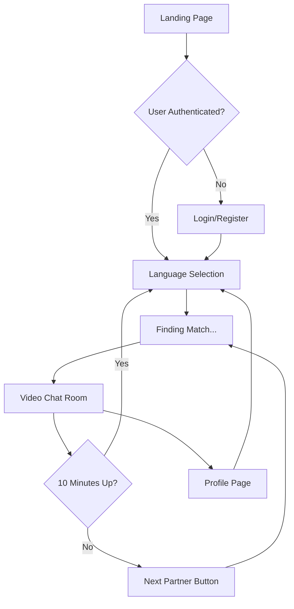

# 🌍 LangConnect - Global Language Learning Platform

A modern, full-stack web application for learning languages through real-time 10-minute video conversations with people around the world.


---

## ✨ Features

### 🔐 Authentication System
- Email/password registration and login
- User profiles with full name, email, and gender
- Gender-based matching rules (male-to-male, female-to-female only)

### 🌐 Language Selection
Support for 7 languages:
- 🇬🇧 English
- 🇷🇺 Russian
- 🇸🇦 Arabic
- 🇰🇷 Korean
- 🇯🇵 Japanese
- 🇹🇷 Turkish
- 🇺🇿 Uzbek

### 📹 Video Chat System
- Real-time 1-on-1 video calls via WebRTC
- Smart matching based on language and gender
- 10-minute session timer with auto-disconnect
- Live text chat during calls
- Emoji support

### 🎛️ Controls & Features
- Mute/Unmute microphone
- Turn camera on/off
- "Next User" button to find new partners
- Report/Block functionality
- Online status indicators

### 🎨 Modern UI/UX
- **Dark Mode**: Black background with neon red accents
- **Light Mode**: White background with blue gradient theme
- Smooth animations and transitions
- Fully responsive (mobile + desktop)
- Startup-level professional design

### 👤 User Profile
- View personal information
- Session statistics (sessions, minutes, partners)
- Theme toggle
- Logout functionality

---

## 🚀 Quick Start

### Frontend (Already Built!)

The frontend is complete and ready to use. All pages and components are built with:
- ✅ React + TypeScript
- ✅ Tailwind CSS v4
- ✅ Motion (Framer Motion) for animations
- ✅ React Router for navigation
- ✅ WebRTC ready

### Backend Setup Required

To make this fully functional, you need to set up the backend:

1. **Connect Supabase**
   - Go to the **Make settings page**
   - Click "Connect Supabase"
   - Follow the connection flow

2. **Choose a WebRTC Provider**
   - Recommended: [Daily.co](https://daily.co) (Free tier available)
   - Alternative: Agora.io or custom solution
   - Add API keys to Supabase secrets in settings

3. **Deploy Edge Functions**
   - See `BACKEND_SETUP.md` for detailed instructions
   - Functions handle user matching and room creation

📖 **Full backend setup guide:** See `BACKEND_SETUP.md`

---

## 🏗️ Architecture

### Frontend Stack
```
├── React 18.3.1
├── TypeScript
├── Tailwind CSS 4.x
├── Motion (Framer Motion)
├── React Router DOM
├── Socket.io Client (for signaling)
└── Simple Peer (WebRTC)
```

### Backend Stack (To Be Connected)
```
├── Supabase
│   ├── Authentication
│   ├── PostgreSQL Database
│   ├── Realtime subscriptions
│   └── Edge Functions
│
├── WebRTC Service (Daily.co / Agora / Custom)
│   ├── STUN/TURN servers
│   ├── Signaling
│   └── Media streaming
│
└── Optional: Redis for session caching
```

---

## 📁 Project Structure

```
/src
├── /app
│   ├── App.tsx                 # Main app with routing
│   └── /components
│       ├── LandingPage.tsx     # Marketing/home page
│       ├── LoginPage.tsx       # Login form
│       ├── RegisterPage.tsx    # Registration form
│       ├── LanguageSelectPage.tsx  # Language selection
│       ├── VideoChatRoom.tsx   # Main chat interface
│       ├── ProfilePage.tsx     # User profile
│       ├── ProtectedRoute.tsx  # Auth guard
│       ├── Navigation.tsx      # App navigation
│       └── ThemeToggle.tsx     # Dark/Light mode toggle
│
├── /contexts
│   ├── AuthContext.tsx         # User authentication state
│   └── ThemeContext.tsx        # Theme management
│
├── /hooks
│   └── useWebRTC.ts           # WebRTC connection logic
│
├── /utils
│   └── languages.ts           # Language configuration
│
└── /styles
    ├── theme.css              # Design tokens
    └── fonts.css              # Font imports
```

---

## 🎯 User Flow



---

## 🔒 Security Features

### Gender-Based Matching
- Database-level constraints prevent cross-gender matching
- Client-side validation
- Server-side enforcement

### Authentication
- Supabase Auth with JWT tokens
- Password hashing
- Protected routes
- Row-level security (RLS) policies

### Data Protection
- No PII stored unnecessarily
- Session data auto-cleanup
- Secure WebRTC connections (DTLS/SRTP)

---

## 🎨 Theme System

### Dark Mode (Default)
- Background: Pure black (#000000)
- Primary accent: Red (#EF4444)
- Neon glow effects
- High contrast for readability

### Light Mode
- Background: White with blue gradients
- Primary accent: Blue (#3B82F6)
- Soft shadows
- Clean, minimal design

**Toggle:** Floating button (top-right) or in Profile settings

---

## 📱 Responsive Design

- **Mobile**: Optimized for phones (320px+)
- **Tablet**: Adapted layout for medium screens
- **Desktop**: Full-featured experience (1024px+)
- **4K**: Scales beautifully on large displays

---

## 🔊 Sound Effects

- **Connect**: High-pitched beep when matched
- **Disconnect**: Low-pitched beep when session ends
- Uses Web Audio API for audio feedback

---

## 🧪 Testing

### Frontend Testing (Current State)
```bash
# The app runs in dev mode
# Test all pages and interactions
# Uses mock data for demo purposes
```

### Backend Testing (After Setup)
```bash
# Test authentication
curl -X POST 'https://your-project.supabase.co/auth/v1/signup'

# Test matching
curl -X POST 'https://your-project.supabase.co/functions/v1/match-users'

# Monitor Realtime
# Open Supabase dashboard → Realtime → Watch matching_queue table
```

---

## 🚀 Deployment

### Frontend
- Already running in Make/Figma environment
- For production: Deploy to Vercel, Netlify, or Cloudflare Pages

### Backend
- Supabase: Managed hosting included
- Edge Functions: Auto-deployed via Supabase CLI
- WebRTC: Daily.co handles infrastructure

---

## 📊 Scaling Strategy

### Phase 1: MVP (0-1K users)
- Supabase free tier
- Daily.co free tier
- Single region deployment

### Phase 2: Growth (1K-10K users)
- Supabase Pro plan
- Daily.co paid plan
- Add monitoring (Sentry, PostHog)

### Phase 3: Scale (10K-100K users)
- Database read replicas
- CDN for assets
- Geographic distribution

### Phase 4: Enterprise (100K+ users)
- Custom WebRTC infrastructure
- Multi-region deployment
- Redis caching layer
- Load balancing

---

## 🛠️ Development

### Current Features (✅ Complete)
- ✅ Full UI/UX for all pages
- ✅ Authentication flow (mock)
- ✅ Language selection
- ✅ Video chat interface
- ✅ Text chat
- ✅ Timer system
- ✅ Theme toggle
- ✅ Routing & navigation
- ✅ Responsive design
- ✅ Animations

### Requires Backend Connection
- ⏳ Real Supabase authentication
- ⏳ Database operations
- ⏳ Live user matching
- ⏳ Actual WebRTC signaling
- ⏳ Real-time chat sync
- ⏳ Session persistence

---

## 💡 Future Enhancements

1. **AI Features**
   - Real-time translation
   - Conversation suggestions
   - Grammar correction

2. **Gamification**
   - Achievement badges
   - Learning streaks
   - Leaderboards

3. **Social Features**
   - Add favorites
   - Friend system
   - Schedule sessions

4. **Analytics**
   - Learning progress tracking
   - Speaking time analysis
   - Vocabulary expansion metrics

5. **Monetization**
   - Premium subscriptions
   - Ad-free experience
   - Priority matching

---

## 🤝 Contributing

This is a prototype/MVP. For production use:

1. Complete backend setup (see BACKEND_SETUP.md)
2. Add comprehensive testing
3. Implement analytics
4. Add monitoring and logging
5. Enhance security measures
6. Optimize performance

---

## 📄 License

This project is a demonstration/prototype. Modify and use as needed for your own projects.

---

## 🆘 Need Help?

- **Backend Setup**: Read `BACKEND_SETUP.md`
- **Supabase**: https://supabase.com/docs
- **WebRTC**: https://webrtc.org
- **Daily.co**: https://docs.daily.co

---

## 🎉 Ready to Launch!

The frontend is complete and ready to use. Once you connect the backend services:

1. Users can register and login
2. Select a language to practice
3. Get matched with partners (same gender, same language)
4. Have 10-minute video conversations
5. Use text chat and controls
6. Switch partners with one click

**Let's make language learning accessible to everyone! 🌍🗣️**

---

Made with ❤️ using React, Tailwind CSS, and Supabase
